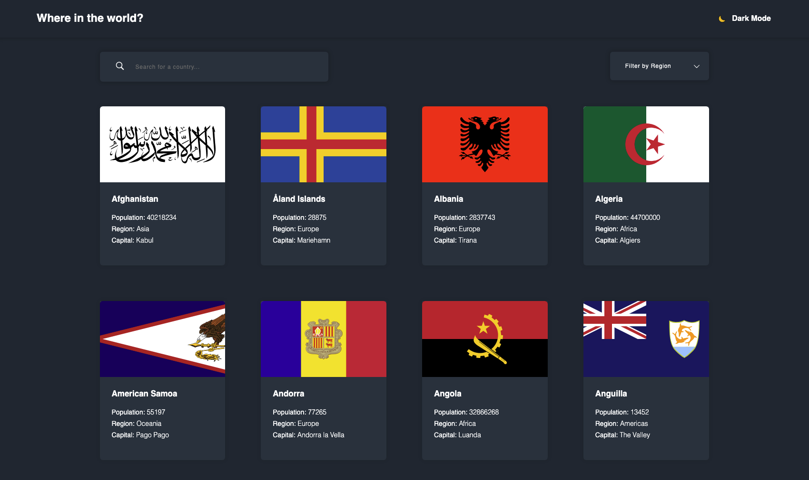

# Frontend Mentor - REST Countries API with color theme switcher solution

## Welcome! 👋

This is a solution to the [REST Countries API with color theme switcher challenge on Frontend Mentor](https://www.frontendmentor.io/challenges/rest-countries-api-with-color-theme-switcher-5cacc469fec04111f7b848ca). Frontend Mentor challenges help you improve your coding skills by building realistic projects.

## Table of contents

- [Frontend Mentor - REST Countries API with color theme switcher solution](#frontend-mentor---rest-countries-api-with-color-theme-switcher-solution)
  - [Welcome! 👋](#welcome-)
  - [Table of contents](#table-of-contents)
  - [Overview](#overview)
    - [The challenge](#the-challenge)
    - [Screenshot](#screenshot)
    - [Links](#links)
    - [Built with](#built-with)
    - [What I learned](#what-i-learned)
  - [Author](#author)

## Overview

### The challenge

Users should be able to:

- View the optimal layout for the site depending on their device's screen size
- Search for a country by name
- Filter for a country by region
- Toggle color theme to their preference

### Screenshot

### Links

- Solution URL: [Github](https://github.com/aycanogut/fem-rest-countries-flag-api)
- Live Site URL: [Vercel](https://fem-rest-countries-flag-api.vercel.app/)

### Built with

- [React](https://reactjs.org/)
- [TypeScript](https://www.typescriptlang.org/)
- [styled-components](https://styled-components.com/)
- [axios](https://axios-http.com/)
- [ESLint](https://eslint.org/)
- [Prettier](https://prettier.io/)

### What I learned

I learned how to use custom hooks to implement dark mode.
I learned how to use search and filter functionality with the an API request.

## Author

- [Github](https://github.com/aycanogut)
- [LinkedIn](https://www.linkedin.com/in/aycanogut/)
- [Medium](https://medium.com/@aycanogut)
- [Frontend Mentor](https://www.frontendmentor.io/profile/bleedeleventh)
- [CodePen](https://codepen.io/aycanogutt)
